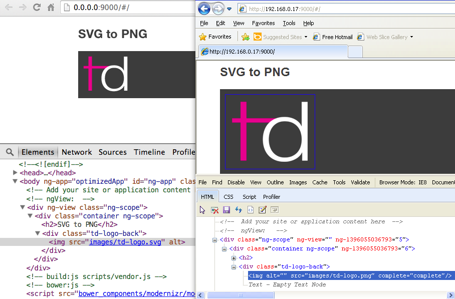

# SVG to PNG fallback in AngularJS

This Angular directive will automatically replace the file extension `*.svg` with `*.png` for browsers that do not support SVG.

Modernizr is a dependency for SVG support detection.


## Usage

You can install **angular-svg-png** and its dependency (Modernizr) as well as inject it in your project using the following command:

```bash
bower install angular-svg-png --save
grunt bower-install
```

After install, add `svgPng` to your app's dependencies.

The screenshot below shows an SVG image being swapped out for a PNG.

